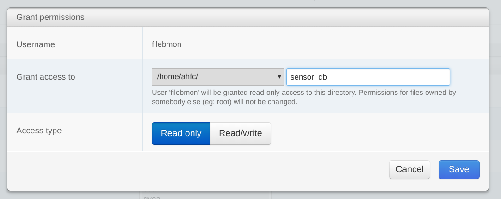

# Notes on Installation of Script on AHFC Webfaction Server

These notes document the installation of the file-to-bmon script on the Alaska Housing Finance
Corporation [Webfaction](https://www.webfaction.com/) server.  In that installation,
the script is periodicially run as a cron job, processing any new files that have
arrived in the file source directories via FTP since the prior run of the script.  This installation is complicated because the data files and the
sensor ID to BMON ID mapping file are located in different User accounts on the server.  
An installation where all files are owned by one User would be much simpler.

The "file-to-bmon" repo is cloned into the "filebmon" User directory on the AHFC Webfaction server. That "filebmon" User has read/write access to all of the Users that are suppliers of files to process (such as "cea" and "gvea").  Multipler User accounts are set up so that each supplier of files has their own FTP site.  Configure a new supplier of files like so:

>Assume the new user is named "newutil" and the User has been added via the Webfaction control panel.
>
>Through the Users menu in the Webfaction control panel, give the User "filebmon" Read/Write access to the files in the "newutil" group.  Do this by adding the "newutil" group to the "filebmon" user, but then clicking the Grant Permissions button and setting permissions to Read/Write instead of just Read.  Write access is needed because file-to-bmon writes directories and files beneath the directory holding the data files.
>
>Add a `file_sources` entry in the YAML configuration file for the data files provided by "newutil"

The SQLite database that maps Sensor IDs to BMON servers is housed in the main account ("ahfc" User) directory at:

    /home/ahfc/sensor_db/sensor_to_bmon.sqlite

Having it there made it easily accessible to the [phpliteadmin tool](https://www.phpliteadmin.org/), 
which allows for adding and editing 
Sensor IDs that are being processed.  That AHFC phpliteadmin tool 
is accessible at:  http://ahfc.webfactional.com/editdb/phpliteadmin.php .

The Sensor-to-BMON SQLite file was made accessible to the "filebmon" user by using the Control Panel, 
putting the "filebmon" User into the "ahfc" group and granting Read Only access permission to the 
"/home/ahfc/sensor_db" directory by using the "Grant Permissions" button.  The image below
shows the dialog that appears after using the Grant Permissions button:

The YAML configuration file for the file-to-bmon script is located in the
"filebmon" User directory at `/home/filebmon/f-to-b-config/config.yaml`.

Run the file-to-bmon script every hour through a cron job:

    7 * * * * /usr/local/bin/python3.7 /home/filebmon/file-to-bmon/loader/process_files.py /home/filebmon/f-to-b-config/config.yaml >> /dev/null 2>&1

Note the explicit path to the Python 3.7 interpreter.  It was also necessary to install all needed libraries for the script in the "file-to-bmon" User account, using "pip3.7 install requests", for example.
