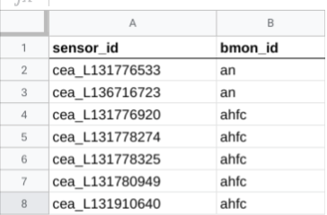

# Documentation of Script Results and Configuration

## Results of Script Execution

There are a number of results that occur from executing the `process_files.py` script:

* The sensor readings extracted from the set of files targeted by the script
are posted to the designated BMON servers (the target files and BMON servers
are determined in the Configuration file described later).  The readings are transferred
via an HTTP Post method, as described in [this section of the BMON documentation](https://bmon-documentation.readthedocs.io/en/latest/setting-up-sensors-to-post-to-bmon.html#storing-multiple-sensor-readings).  Because
HTTP is used to store the readings, this script can be run from a computer separate
from the computers hosting the BMON applications.
* As the script processes each file, two new files are created--one holding lines from
the original file that were fully processed without errors, and a second file containing
lines from the original file that caused errors during processing.  These two new files
are stored in subdirectories of the directory containing the original files being processed.
The subdirectories are named `completed` and `errors`.  The new files are stored in these
subdirectories using the original file name plus `_ok` and `_err` suffixes.  Files in the
`completed` subdirectory are only retained for a limited amount of time (controlled by
a Configuration parameter), but files in the `errors` subdirectory are stored indefinitely.
These files can be edited and then moved back into the original directory so that processing
can be tried again.
* After processing, the processed file is deleted, since its contents are essentially retained
in the two files in the `completed` and `errors` subdirectories.
* A log file that holds information about each file processed and records processing error
messages is also created and appended to.  It is named `process_files.log` and is stored 
in the `log` subdirectory of the directory holding the configuration file.

## The Configuration File

The Configuration file controls the operation of the script, and the path to the Configuration
file must be provided as the first command line argument when using the script.
There is an example Configuration
file provided [in the repository here](config/config_example.yaml).  The Configuration file uses
[YAML format](https://rollout.io/blog/yaml-tutorial-everything-you-need-get-started/) for
simplicity.  This section describes the contents of the Configuration file.

---

```YAML
sensor_to_bmon_file: /home/cea/meter_db/meters.sqlite
```
The `sensor_to_bmon_file` setting states the path to the file that maps Sensor IDs to BMON servers.
For each Sensor ID read from the files being processed, this mapping file is checked to 
see where the reading should be posted.  BMON servers are identified by the IDs that you
create in the `bmon_servers` section of this Configuration file.  In the sample Configuration
file, you will find two BMON server IDs: `ahfc` and `mssd`.

There are three possible formats for this Sensor ID-to-BMON mapping file.  The file can
be a SQLite database, and if so, the file must end with the `.sqlite` extension.  If the file
is a SQLite database, the database must have a table named `sensor_target` and that table
must have two string columns: `sensor_id` and `bmon_id`.  Each row of the table maps a
particular Sensor ID to a destination BMON server. If a SQLite database file is used for this 
mapping, a simple SQLite web-based editing application can be used to maintain the data.  Such 
an application is [phpLiteAdmin](https://www.phpliteadmin.org/).

Another possible format for the mapping file is a comma-separated-value (CSV) text file. If
this file format is used, each row of the file should have a Sensor ID and the target BMON ID,
separated by a comma.  The file name must end in the extension `.csv`. Here is an example of
the file contents:

```text
AK9023432, ahfc
AN448234223, mssd
sensor_xyz, ahfc
```
Finally, the most convenient format for this mapping file from an editing standpoint is a
Google Sheets spreadsheet.  If this format is used, the `sensor_to_bmon_file` entry in the
configuration file should be the file name of the Sheets document, e.g. `sensor_to_bmon`.
If `file-to-bmon` sees no extension on this file name, it assumes that it is the name of a
Google Sheets document.  If this format is being used, and additional entry in the configuration
files is required: the `google_credentials_file` entry.  This entry is the full path to a
JSON Google API credentials file, and can be left blank if using the SQLite or CSV formats.
More information about creation of this credentials file and steps
to share a Google Sheets spreadsheet with the `file-to-bmon` application can be found
[here](https://towardsdatascience.com/accessing-google-spreadsheet-data-using-python-90a5bc214fd2).
Note that the [gspread](https://gspread.readthedocs.io/en/latest/) library is used by
`file-to-bmon` to access the spreadsheet.  The Google Sheets spreadsheet must havin the Sensor
ID to BMON mapping information on the first sheet of the spreadsheet.  Two columns must be present
with the column titles of `sensor_id` and `bmon_id` in row 1 of the spreadsheet.
Here is a sample showing the format of the spreadsheet:


The `sensor_to_bmon_file` file is optional *if* instead you provide a `default_bmon` setting
for each of the file sources defined in the `file_sources` section of this Configuration
file.  If you take this approach, you do not need to provide the `sensor_to_bmon_file` setting
line in the Configuration file.

If a sensor ID is found in one of the processed files that is not provided in the 
`sensor_to_bmon_file` and there is no `default_bmon` setting for the file source, the
line containing the Sensor ID is considered an error, and it is added to the error file.

---

```YAML
logging_level: INFO
```

The `logging_level` setting determines how much information will be put into the application's
log file, `process_files.log`.  The choices for this setting, ranging from the most amount of
information to the least, are `DEBUG`, `INFO`, `WARNING`, `ERROR`, `CRITICAL`.  If this setting
is not provided, it defaults to `INFO`.

---

```YAML
dry_run: False
```

If `dry_run` is True, the sensor readings will *not* be posted to BMON servers.  Instead,
they will be written to a file in the `debug` subdirectory beneath the directory where the
data files are.  The debug files are named according to the ID of the BMON server they are
destined for. Also, when `dry_run` is True, the files being processed are *not* deleted
after processing.

---

```YAML
file_sources:
  - pattern: /home/alan/chugach/*.csv
    reader: cea
    default_bmon: ahfc
    time_zone: US/Alaska
    file_retention: 3
    chunk_size: 200
  - pattern: /home/alan/mea/*.csv
    reader: mea
```

The `file_sources` key or section in the Configuration file consists of a list of file sets
that will be processed by the script.  The `-` character starts a new list item, describing
a particular set of files and how they should be processed.  In the sample above, there
are two different sets of files that will be processed, because there are two `-` items
indented under the `file_sources` key.

For each set of files, there are a numbers of settings that control the processing of the
files.  First, there are two *required* settings that must be present for each file set:
`pattern` and `reader`.

`pattern` is file pattern compatible with the [Python glob function](https://docs.python.org/3/library/glob.html).
In the example above, the `pattern` for the first file set is `/home/alan/chugach/*.csv`.
This pattern identifies all files withe the `.csv` extension found in the `/home/alan/chugach`
directory.  All of those files will be processed by the script.

The second required setting for each file set is the `reader` setting.  This setting idenfies the
Python Reader module that will be used to parse the file; each different file format requires
a different type of reader module.  There is a subsequent section that explains these Readers in
more detail.  For the example above, the Reader is `cea`, so the script will use the Reader found
in the `cea.py` file in the `loader/readers` directory of this project.  So, the `reader` must
name a Python module (without the `.py` extension) found in the `loader/readers` directory.
The structure of that Reader module is described in a subsequent section.  The `cea` reader in the
example happens to be a Reader that knows how to parse readings from a Chugach Electric
Association 15-minute elecric meter data file. 

There are a number of optional settings for each file set, including:

* `default_bmon`: This is the BMON ID (must match one of the keys in the `bmon_servers` section)
of the BMON server that will be targeted if the Sensor ID is not in the `sensor_to_bmon_file`, or
the `sensor_to_bmon_file` does not exist.  If `default_bmon` is not provided and a Sensor ID without
a mapping entry appears, the file line will be considered an error and added to the errors file.
* `time_zone`: BMON stores timestamps in Universal Coordinated Time (UTC), and therefore Reader modules
must convert date/times in the processed file into UTC.  If timezone information is not provided in
the date/time string, the Reader will need to know the timezone associated with the value.
This setting provides that timezone.  It should be a value from [this list](https://en.wikipedia.org/wiki/List_of_tz_database_time_zones).
If not provided, it defaults to `US/Alaska`.
* `file_retention`: This gives the number of days that the files in the `completed` subdirectory
will be saved before deleting.  These files contain lines that were successfully processed
by the script, so the data from these lines should be in the BMON database.  if `file_retention`
is not provided for the file set, it defaults to 3 days.
* `chunk_size`: Sensor readings are posted in batches to the BMON servers.  `chunk_size` sets the
minimum number of readings that will be sent to a BMON server in one batch (all readings will
ultimately be sent, so the final batch may be smaller than `chunk_size`).  This setting defaults
to 300, which is generally a suitable value.

---

```YAML
bmon_servers:
  ahfc:
    url: https://bms.ahfc.us/readingdb/reading/store/
    store_key: xyz
  mssd:
    url: https://bmon.matsuk12.us/readingdb/reading/store/
    store_key: def
```

The last section of the Configuration, `bmon_servers` file contains keys for each of the
BMON servers that sensor readings can be directed to (this is not a list like the `file_sources`
section; each BMON server has a separate key in the section). The keys are the IDs of each
BMON server; in the example above: `ahfc` and `mssd` are the BMON IDs.  These are values that
appear in the `sensor_to_bmon_file` file and in the `default_bmon` setting.

Each BMON server, in turn, has two settings the `url` and the `store_key`:

* `url`: This is the URL endpoint for posting sensor readings to the BMON server. It will
always end with `/readingdb/reading/store/`.
* `store_key`: This is the secret store key that gives authority to store readings into
the BMON database. It appears in the `settings.py` file for the BMON server.

---

## Reader Classes for Parsing Files

Reader classes are used to parse sensor readings from the files being processed.  Each
file format being processed will require a separate Reader class.  A Reader class is a
Python class, and thus involves programming knowledge of Python in order to create.  Each
Reader class occupies a separate Python module file, and all of the files are located in
the `/loader/readers` directory of this project.  The name of the Python module file, without
the `.py` extension is the name of the Reader for purposes of the `reader` setting
in the `file_sources` section of the configuration file described above.  So, when using the Reader
found in the `/loader/readers/cea.py` file, the name `cea` should be used for the `reader`
setting in the `file_sources` section.

A Reader class has a number of requirements, best understood by looking at a sample Reader
class.  Here is the [`cea` Reader class](loader/readers/cea.py):

```python
"""Reader file to parse Chugach Electric Association 15-minute
meter data.
"""
from .base_reader import BaseReader

class Reader(BaseReader):
    
    def read_header(self, fobj, file_name):
        # There are no header lines in the file
        return []

    def parse_line(self, lin):

        # there is one reading per line, fields are separated by commas.
        fields = lin.split(',')
        meter_num, dt_tm_str, kwh = fields[:3]

        # multiply by 4 to get average kW during 15 minute interval
        kw = float(kwh) * 4.0

        ts = self.ts_from_date_str(dt_tm_str, '%Y-%m-%d %H:%M:%S')
        # add 7.5 minutes to put timestamp in middle of interval
        ts += 7.5 * 60

        return [(ts, meter_num.strip(), kw)]
```

The first requiement is that the file must contain a class named `Reader` and that class
must subclass the base_reader.BaseReader class, as shown in the above sample file.

Next, the class must implement two methods: `read_header()` and `parse_line()`.  First
addressing the `read_header()` method, it must return a list of header lines from the file
being processed. These lines do not contain sensor data, but may contain sensor labels
or other general information from the file.  These are needed by the script because they
are used to create header lines for the `_ok` and the `_err` files that are created for
each file processed.  It may also be the case that this particular Reader class may need
information from those header lines in order to subsequently process the lines containing
sensor readings (save needed information as object attributes, e.g. 
`self.sensor_id = extracted_id`).

There are two parameters passed into the `read_header()` method: `fobj` is the
opened-for-reading file object, and `file_name` is the full path to the file.  `fobj`
can be used to easily read header lines from the file.
In the sample above, there are no header lines in the file, so an empty list is returned, and
neither `fobj` nor `file_name` are used. But, if there were three header lines in the file, 
the code would look like this:

```python
def read_header(self, fobj, file_name):
    header_lines = []
    for i in range(3):
        header_lines.append(fobj.readline())
    return header_lines
```

Or, more succinctly:

```python
def read_header(self, fobj, file_name):
    return [fobj.readline() for i in range(3)]
```

Note that the `readline()` method of the file object leaves the newline character
at the end of each line.  Those newline characters should be left in place as the
calling routine expects them.

Next, consider the `parse_line()` method, which needs to be implemented by the Reader
class.  This method receives one parameter, `lin`, which is the line of data to be
parsed to extract sensor reading(s).  The calling routine has removed whitespace from
the start and end of `lin`.  The job of the `parse_line()` method is to return a list of
sensor reading(s) parsed from the line.  Each sensor reading is a three-tuple, consisting
of: (Unix Epoch timestamp, sensor ID, sensor value).  The Unix Epoch timestamp is a floating
point number indicating the time of the reading as the number of seconds past
January 1, 1970 00:00. The 'sensor ID' is a string ID uniquely identifying this sensor, 
and the sensor value is the floating point value of the sensor reading.

The BaseReader class provides a useful utility function that converts a string date/time
into a Unix Epoch timestamp value. The function is available as `self.ts_from_date_str`, and
you can see it in use in the sample code above.  It uses the timezone that was specified in the
Configuration file for this set of files.

The file format for the sample code above only has one sensor reading for each line
in the file.  Thus, the code above only returns one tuple within the returned list of
readings.

### Testing Reader Classes

A utility script is available that allows you test your Reader class before deployment.
The script is `tools/test_reader.py`. Example usage is:

    python3 test_reader.py gvea /home/user12/data/testfile.csv

In this example, `gvea` is the module name holding the Reader class to be tested, and 
`/home/user12/data/testfile.csv` is the path to a file containg test data to read.  Any
errors that occur during execution are allowed to surface to facilitate debugging.
If the script executes successfully, it prints the header rows from the data file, and
it prints the sensor readings that are parsed from the first three rows of the data
file.
