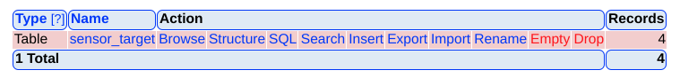

# Editing and Adding Sensor-to-BMON Mapping Relationships for AHFC Script

Each sensor read by the file-to-bmon script needs to be sent to a paricular BMON
server.  To determine which BMON server should be the destination for a
particular sensor, a SQLite or CSV text file is used to map Sensor IDs to
BMON IDs. The BMON IDs are established in the YAML Configuration file for
the script.  Also, a default BMON ID can be provided for a file source, and
any sensors not in the mapping file will be sent to that server.

For the Alaska Housing Finance Corporation (AHFC) file-to-bmon script, a SQLite database
is used to provide the mapping from Sensor ID to BMON server.  To facilitate editing
that database, the [phpLiteAdmin web softare](https://www.phpliteadmin.org/) is used.
Access to the AHFC installation of phpLiteAdmin is available at http://ahfc.webfactional.com/editdb/phpliteadmin.php.
A password is required for access.

That software currently allows managing two different SQLite database: the database
of Sensor readings in the AHFC BMON system, and the sensor-to-BMON mapping database
discussed here.  On the main page of the phpLiteAdmin software, select the 
"Sensor to BMON Map" database in the "Change Database" box in the upper left corner.
On the Structure tab that appears, look for the this row allowing operations on the
"sensor_target" table:

Clicking the "Browse" link in that row will allow you to see and edit any of the curent entries in
the table.  Entries are simply the Sensor ID of the sensor (usually the meter number for electric
utility entries) and the BMON ID of the BMON server where the reading should be sent.

Clicking the "Insert" link in the row will allow you to add new entries to the table
for sensors that are not yet present in the table.
